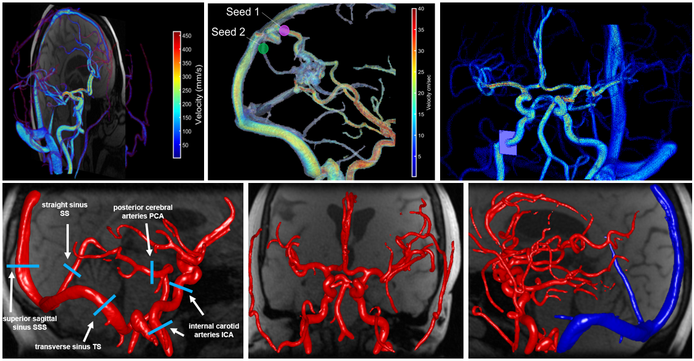

MATLAB-package
=========

**Current Maintainers: Grant S. Roberts** \
Previous Maintainer: Carson A. Hoffman

### Citations ### 
If you are using the QVT for cranial 4D flow MRI analysis in your study, please cite the following papers:

- [Schrauben, E., Wahlin, A., Ambarki, K., Spaak, E., Malm, J., Wieben, O., & Eklund, A. (2015). Fast 4D flow MRI intracranial segmentation and quantification in tortuous arteries. J Magn Reson Imaging, 42(5), 1458-1464. doi:10.1002/jmri.24900](https://pubmed.ncbi.nlm.nih.gov/25847621/)

- Hoffman, C., Roberts, G. S., Berman, S. E., Eisenmenger, L. B., & Wieben, O. (2019). Towards Automated Cranial 4D Flow Cranial Analysis. Paper presented at the Society for Magnetic Resonance Angiography. p.80.

### License ###
BSD 2-Clause

## Introduction ##
4D flow MRI is a time-resolved, 3D phase contrast imaging technique that allows for non-invasive acquisitions of velocity vector fields, allowing for the measurement blood velocities within an imaging volume. By obtaining blood velocities, we can calculate blood flow and other hemodynamic parameters which have been used to diagnose and characterize a wide range of intracranial disease, such as aneurysms, arteriovenous malformations, and even vascular dementia. Despite advances in 4D Flow MRI acquisition and reconstruction, efficient and repeatable post-processing for cranial 4D flow MRI datasets is still quite challenging. The high dimensionality of the reconstructed datasets (1 temporal, 3 spatial dimensions, and 3 velocity directions) and the complexity of the brain vasculature can lead to long post-processing times. Typical processing steps usually require manual segmentation and manual placement of double-oblique cut-planes for hemodynamic analysis, approaches that limit reproducibility and are impractical when analyzing many vessels over a large number of datasets. 

To address this issue, our group developed a semi-automated post-processing tool that automated vessel segmentation, vessel centerline generation, placement of tangential cut-planes, and flow assessment. This work started in 2015 with Eric Schrauben (alumni of Oliver Wieben Lab) in collaboration with the Umea University 4D flow group. More recently in 2018, Carson Hoffman and Grant Roberts made substantial updates to the tool, improving visualization and overall usability of the tool. 

The QVT (Quantitative Velocity Tool) user interface that we developed is designed to load in reconstructed 4D flow MRI data and perform the following steps automatically:

* Perform global segmentation on the volume to create an angiogram
    * Threshold-based algorithm ("sliding threshold" method developed by Carson Hoffman)
* Skeletonize the angiogram to create vessel centerlines (1D lines representing the center of the vessel in 3D space)
* Identify unique branches on the vessel centerline
* Create tangent cut-planes orthogonal to the direction of the vessel at every centerline point
* Segment vessels in each generated cut-plane
    * Threshold-based segmentation *OR* k-means clustering segmentation 
* Calculate hemodynamics at each cut-plane (blood flow rates, pulsatility, resisitivity, vessel area, etc.)

This process takes around 5 minutes, depending on your machine. Afer the above steps have completed, a 'pcviprData.mat' file is saved which can be loaded directoly into the tool and allows one to skip the pre-processing steps above and load 4D flow data within seconds. Once data has been loaded into the tool, a user can then select a vessel of interest and save hemodynamic information at that specific vessel location. 

One of the most unique features of this tool is the 3D vessel selection window, which allows a user to rotate/zoom/pan a 3D representation of the cranial vasculature (centerlines) in order to locate vessels of interest for hemodynamic analysis. This interactive interface also color-codes the vessel centerlines by flow, pulsatility, or any other hemodynamic parameter of interest, allowing one to visualize these parameters across the entire vasculature, not just at 1 location. We can also show the semi-transparent angiogram overlayed on the vessel centerlines, which shows what the vessels truly look like in 3D space. Additionally, we created a real-time control window, which shows 2D cut planes and flow curves at selected vessel points. This window is updated when a user selects a new vessel location of interest in the interactive window. We also created a visualization tool to show vector glyphs and colored angiograms for publication-quality images.

Please contact us with any issues and we will address them as quickly as we can. 

## Installation ##
Requires MATLAB version > 2018

Download or clone the 'QVT' repository into the directory of your choice (e.g., 'C:\Users\username\Documents\MATALB'). From MATLAB, add the 'QVT' folder to your Matlab search path. This can be done several ways:
1. Move to the directory containing the 'QVT' folder, right click on 'QVT', select "Add to Path --> Selected Folders and Subfolders". 
2. `>> addpath(genpath('C:\Users\username\Documents\MATALB\QVT'))`

### Dependencies ###
Machine Learning Toolbox \
Optimization Toolbox \
Image Processing Toolbox

## Usage ##
(Optional) In Matlab, change to the directory where the 4D flow data exists. This is not necessary but is convenient for locating 4D flow data and for accessing saved data after processing.

From the command window, type the following command to open the GUI:
`>> paramMap`

Once opened, select 'Load Data'. From the pop-up window, select the folder which contains 4D flow MRI data.

**IMPORTANT NOTE: Currently, this data must be in a format specific to our institution** \
From the PCVIPR reconstruction, data may be in .dat format (multiple .dat files of containing 3D volumes of magnitude, complex difference, and velocity data) or in HDF5 format (single file usually named 'Flow.h5'). Both formats can be loaded into the tool with the 'loadpcvipr.m' and 'loadHDF5.m' functions. 

In the near future, we plan to implement functions to load more universal 4D flow data formats (e.g., DICOM series, NIFTI?, or ISMRMRD?) from other institutions into our tool. However, this is currently not possible. If you have data from outside of UW-Madison and would like to use the QVT, please reach out and we can help develop functions to load in this data.

## Additional Resources ##

[Video Demo](https://mediaspace.wisc.edu/)

